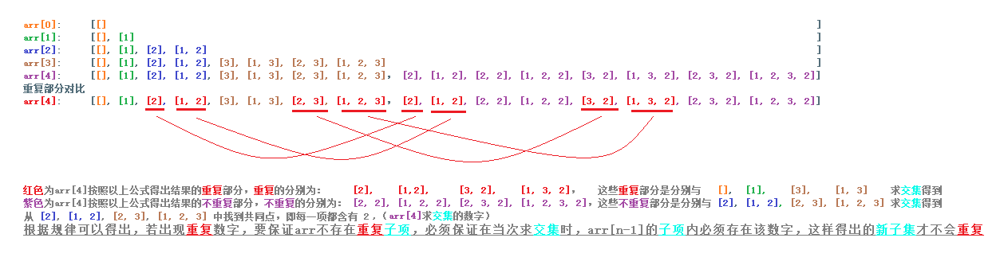

给你一个整数数组 nums ，其中可能包含重复元素，请你返回该数组所有可能的子集（幂集）。

解集 不能 包含重复的子集。返回的解集中，子集可以按 任意顺序 排列。

示例 1：

- 输入：nums = [1,2,2]
- 输出：[[],[1],[1,2],[1,2,2],[2],[2,2]]

示例 2：

- 输入：nums = [0]
- 输出：[[],[0]]

提示：

1 <= nums.length <= 10

-10 <= nums[i] <= 10

区别于上一题`78.子集`，本题需要去重

## 去重思想：

假设一个数字与一个二维数组的交集表示为：

二维数组的每一个子数组依次添加该数字组成一个新的二维数组，例如`数字2`与二维数组`[[],[1]]`的交集为`[[2], [1, 2]]`

遍历nums数组，让`nums[i]`与`当前已求得的子集数组`的每一项求交集，求交集过程中：

- 若`nums[i]是首次`出现，则肯定`不会`出现重复项；

- 若`nums[i]不是首次`出现，则肯定`会`出现重复项，执行去重操作：

    - 检测子集的每一个子项，若`num[i]`不存在，则跳过该子项达到去重目的。

      nums中的每一个数字都会与已求得子集的每一项两两结合。出现重复数字时，重复数字都会与相同子项结合。如果不跳过，则会造成子集重复。比如：

      初始默认子集：`[[]]`，求子集数组：nums:`[2,2]`
      `nums[0]`和`nums[1]`都会与初始子集内的的第一项`[]`结合，出现重复项：`[2], [2]`

    - 若`nums[i]`存在，则稍微复杂一点，需要判断循环到`nums[i-1]`时，该数字重复的次数`x`，以及`nums[i]`在子集的当前子项出现的次数`y`，如果`x === y`，则当前子项与`nums[i]`求交集，否则跳过以达到去重目的。

      同理，重复数字皆会与已求得子集的每一项两两结合。为了保证不重复，必须保证子集的当前子项内该重复数字的数量与遍历到`nums[i-1]`时该数字重复的次数相同。这样才不会产生重复子集。比如：

      子集`arr`（这是`nums`为`[1,2,3,2,2]`的子集的一部分）：[[], [3], [2, 3], [2, 1], [2], [2, 2], [2, 1, 2], [2, 3, 2] ...], 求子集数组nums：[2, ..., 2, ..., 2]

      当`nums`循环到第二个`2`时，得到类似`arr`的子集数组；

      当`nums`循环到第三个`2`时，依次与`arr`中每一项结合。根据以上`x`和`y`的定义，带入数字得到`x=2`(注意`x`不是3，因为`x`是`2`取的是`num[0]`到`nums[i-1]`之间重复的次数)：

        - 当`y=0`时，符合条件的`arr`子项为`[[], [3]]`，它们与`2`结合后得到`[[2], [3, 2]]`，注意`arr`中已存在该两项；
        - 当`y=1`时，符合条件的`arr`子项为`[[2, 3], [2, 1], [2]]`，它们与`2`结合后得到`[[2，3，2], [2, 1, 2], [2, 2]]`，注意`arr`中已存在这几项；

        - 当`y=2`时，`y=x=2`，符合条件的`arr`子项为`[[2, 2], [2, 1, 2], [2, 3, 2]]`，它们与`2`结合后得到`[[2，2，2], [2, 1, 2, 2], [2, 3, 2, 2]]`，在`arr`中皆不存在；

然后把这个`新得到的数组`与`求交集之前的子集数`合并即为新的子集数组。

## 举例论证：

求数组`[1,2,3,2]`的子集：

`nums`数组从前往后依次遍历每一个元素`nums[i]`, `i`为索引，假设`arr`表示当前循环已得到的子集，

`arr[n]`为`nums`中`前n个`元素的子集，得到：`arr[n] = arr[n-1] + arr[n-1]`与`num[n-1]`的交集，边界值：`arr[0] = [[]]`, `n >= 1`

穷举论证：

    当 i = 0 时，n = 1，nums[0] = 1, arr[1] = arr[0] + arr[0]与nums[0]的交集 = [[]] + [[1]] = [[], [1]]

    当 i = 1 时，n = 2，nums[1] = 2, arr[2] = arr[1] + arr[1]与nums[1]的交集 = [[], [1]] + [[2], [1, 2]] = [[], [1], [2], [1, 2]]

    当 i = 2 时，n = 3，nums[2] = 3, arr[3] = arr[2] + arr[2]与nums[2]的交集 = [[], [1], [2], [1, 2]] + [[3], [1, 3], [2, 3], [1, 2, 3]] = [[], [1], [2], [1, 2], [3], [1, 3], [2, 3], [1, 2, 3]]

    当 i = 3 时，n = 4，nums[3] = 2, arr[3] = arr[3] + arr[3]与nums[3]的交集 = [[], [1], [2], [1, 2], [3], [1, 3], [2, 3], [1, 2, 3]] + [[2], [1, 2], [2, 2], [1, 2, 2], [3, 2], [1, 3, 2], [2, 3, 2], [1, 2, 3, 2]] = [[], [1], [2], [1, 2], [3], [1, 3], [2, 3], [1, 2, 3]， [2], [1, 2], [2, 2], [1, 2, 2], [3, 2], [1, 3, 2], [2, 3, 2], [1, 2, 3, 2]]

    此时出现重复数字2，分析：

      arr[3]：[[], [1], [2], [1, 2], [3], [1, 3], [2, 3], [1, 2, 3]]

      arr[3]与nums[3]求交集的结果项：[[2], [1, 2], [2, 2], [1, 2, 2], [3, 2], [1, 3, 2], [2, 3, 2], [1, 2, 3, 2]]

      arr[3]与nums[3]求交集的结果项的重复项：[[2], [1, 2], [3, 2], [1, 3, 2]]，是与arr[3]中以下子项求交集得到：[[], [1], [3], [1, 3]]

      arr[3]与nums[3]求交集的结果项的不重复项：[[2, 2], [1, 2, 2], [2, 3, 2], [1, 2, 3, 2]]，是与arr[3]中以下子项求交集得到：[[2], [1, 2], [2, 3], [1, 2, 3]]

    结论：

      当求交集时，arr子项中存在重复数字，则求交集后的该子项必定不重复；

      当求交集时，arr子项中不存在重复数字，则求交集后的该子项一定与其他子项重复（子项元素的顺序可能不同）；
           
      以上值分析了重复一次的情况，若nums[i]不止重复一次，则要检测子项内重复数组的个数与nums[i]目前为止重复的次数。

## 图片分析：

